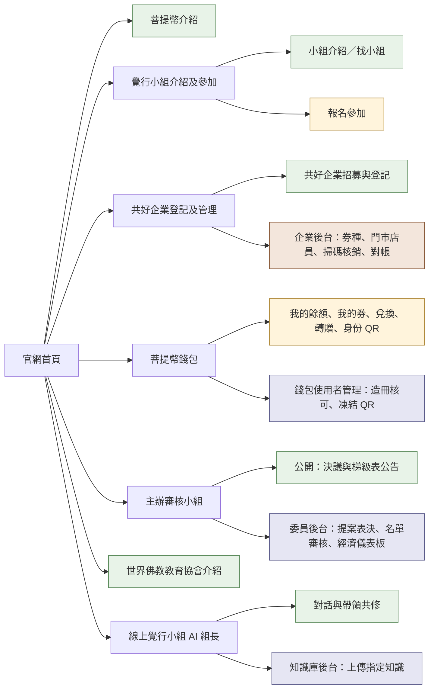
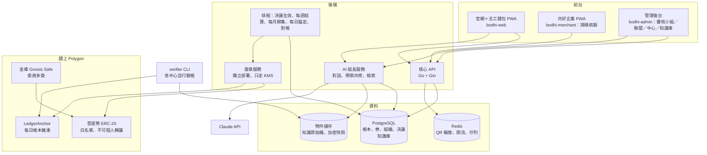
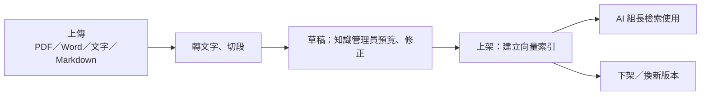

# 菩提幣官網系統架構（草案）

2026-10-02 草案 · 技術棧與單一 repo 已確認，階段 A 已開始實作

## 一句話

禪修志工與教練的服務時數，經「主辦審核小組」審核後核發菩提幣；志工在官網用幣兌換共好企業提供的券，到店出示 QR 核銷。官網同時是對外介紹世界佛教教育協會、覺行小組與菩提幣的入口，並有一位帶領共修的「線上覺行小組 AI 組長」。

本文件把主選單七項對應到 SPEC v2.0（geodown-o/bodhi PR #1）的模組、角色與開發批次，並補上 SPEC 沒有的兩塊：覺行小組與 AI 組長。資料表細節見 [data-model.md](data-model.md)（PR #3）。

## 名詞對照

| 官網用語 | SPEC v2.0 用語 | 說明 |
| --- | --- | --- |
| 主辦審核小組 | 世界佛教教育協會菩提幣決策小組（SPEC 原稱執委會，D34；2026-10-02 確認改名） | 制定梯級表、審核核發名單、核定共好企業上架與額度，志工跨中心服務的核發也由它決定。選單上的「主辦審核小組」就是決策小組（已確認）。 |
| 共好企業 | 商家（聯盟單位＋贊助商家） | 提供券、接受核銷的場所 |
| 菩提幣錢包 | 志工帳戶（餘額＋我的券＋身份 QR） | 志工沒有個人鏈上地址，見〈鏈上與錢包〉 |
| 覺行小組 | SPEC 沒有 | 本文新增：中心底下的共修小組，其共修場次就是可核發的「活動」 |
| 禪修志工／教練 | 志工／禪修教練 | 同 |

## 主選單與網站地圖



綠＝公開頁；黃＝志工登入；咖啡＝共好企業登入；紫＝管理後台（依角色開放）。

| 選單 | 公開頁 | 登入後功能 | 對應 SPEC | 批次 |
| --- | --- | --- | --- | --- |
| 菩提幣介紹 | 理念、怎麼賺幣、怎麼用幣、FAQ、法務狀態說明 | — | §1、企劃書 | A |
| 覺行小組介紹及參加 | 小組介紹、依地區找小組、共修時間 | 報名加入小組 → 中心管理員核可成為志工；報名共修場次 | §3、§8.1（活動＝共修場次） | A（報名表）→ M2、M4 |
| 共好企業登記及管理 | 招募說明、登記表（現有招募頁移入） | 企業後台：券種自建、門市與店員、掃碼核銷、對帳單 | §9、`bodhi-merchant` | A（登記表）→ M5 |
| 菩提幣錢包使用者管理 | 使用說明 | 志工：餘額、可換券種、兌換、轉贈、我的券、動態身份 QR、推播；管理：造冊核可、凍結 QR、查詢流水 | §9.3–9.6、§3 中心管理員 | M2、M5 |
| 主辦審核小組 | 成員、已生效決議、現行梯級表 | 提案、公示、表決、核發名單分級審核、共好企業額度、經濟健康度儀表板 | §5、M3 | M3、M4 |
| 世界佛教教育協會介紹 | 協會介紹、三轉理念、聯絡方式 | — | — | A |
| 線上覺行小組 AI 組長 | 對話、帶領共修 | 知識庫後台：上傳、審閱、上下架知識文件；角色設定 | SPEC 沒有，本文新增 | A |

## 系統元件



- 前台三個 PWA 與 SPEC §14 相同；官網公開頁併入 `bodhi-web`，不另開站。
- **AI 組長是獨立服務**：它要呼叫外部模型、處理檔案上傳，故障或費用暴增時要能單獨關掉，不能拖垮帳本 API。它和核心 API 共用登入與 PostgreSQL，但只讀寫自己的 schema（`guide.*`），碰不到帳本。
- 簽章服務照 SPEC §7 獨立部署，金鑰只在 AWS KMS，API 本身不持有任何私鑰。

## 角色與權限

沿用 SPEC §10 的四種 scope，新增兩個 scope 給 SPEC 沒有的部分。

| 角色 | scope | 主要權限 | 用到的選單 |
| --- | --- | --- | --- |
| 訪客 | — | 瀏覽公開頁、與 AI 組長對話、送出小組報名與企業登記 | 全部公開頁 |
| 志工／禪修教練 | 本人 | 錢包、兌換、轉贈、身份 QR、報名共修 | 錢包、覺行小組 |
| 小組組長（真人） | `group:{id}` | 管理小組成員與共修場次、可擔任活動管理員造冊 | 覺行小組 |
| 活動／場域管理員 | `venue:{id}` | `activity.manage`、`roster.create/submit` | 主辦審核小組（送審端） |
| 中心管理員 | `center:{id}` | 志工造冊核可、凍結 QR、指派場域／小組管理員 | 錢包使用者管理 |
| 中心稽核 | `center:{id}` | 唯讀、`ledger.verify` | 錢包使用者管理（唯讀） |
| 主辦審核小組委員 | `alliance` | `motion.create/vote`、`roster.review/adjust`、`merchant.quota`、`balance.monitor` | 主辦審核小組 |
| 超級管理員 | `alliance` | 執行決議、企業形式審查、品項抽查、全域報表；**不能自行改標準或核發** | 共好企業管理、報表 |
| 共好企業管理員／店員 | `merchant:{id}` | `voucher_type.manage`、`pos.redeem`、`settlement.view` | 共好企業後台 |
| 知識管理員 | `guide` | 上傳、審閱、上下架知識文件；改 AI 組長角色設定 | AI 組長後台 |

`group:{id}` 與 `guide` 是本文新增，要補進 data-model 的 `role_assignment`。

## 鏈上與錢包

照 SPEC v2.0 的兩層架構（D33），這點會影響「錢包」怎麼對外說明：

- **鏈上只有聯盟層級約 40 個地址**：金庫（委員多簽 Gnosis Safe）、各中心、各共好企業、gas 與錨定錢包。合約是 Polygon 上的 ERC-20，小數 2 位、總量固定（暫定 5 億）、白名單限制轉帳方向、幣不能在個人之間轉。
- **志工沒有個人鏈上地址**。「菩提幣錢包」是官網帳戶：餘額與券存在 PostgreSQL，每天把整本帳的雜湊與總負債寫上鏈（LedgerAnchor），各中心用 verifier CLI 自己核對。志工不用管私鑰、不用付 gas，也不會弄丟錢包。
- 每月約 265 筆鏈上交易：金庫撥補中心、每週中心結算給企業、每月企業歸集回金庫、每日錨定。

如果之後希望每位志工都有自己的鏈上錢包，SPEC §4.8 已預留開放路徑，但會碰到 Q19（多用途支付工具）的法務問題，建議先維持現行設計。

## 線上覺行小組 AI 組長

目前的原型是使用者電腦上的 bodhi-guide（localhost:8080/#guide，打包成 bodhi-guide.exe，金鑰放在本機 .env），已改名為「覺行小組線上組長 Sunny」。正式版把它搬上伺服器，原型的角色設定與知識庫內容直接沿用。

**前台**

- **對話**：回答覺行、共修、菩提幣與官網操作問題；回答只根據已上架的知識，並標出引用了哪份文件。查不到就說查不到，並引導到真人小組組長。
- **帶領共修**：使用者選一套共修流程（例如靜坐引導、經文共讀、分享回顧），AI 組長依流程逐步帶領，包含計時、提示語、結束後的分享引導。流程本身是知識庫裡的「共修腳本」文件，由知識管理員上傳，不寫死在程式裡。
- 不碰帳本：AI 組長查不到、也改不了任何人的餘額或券；問到餘額時只引導到錢包頁。

**知識庫後台**



- 每份文件有：標題、分類（覺行知識、共修腳本、菩提幣規則、協會介紹、常見問題）、版本、上架狀態、上傳者、上傳時間。
- 上架前可在後台「試問」：輸入問題，看 AI 組長會引用哪幾段、怎麼回答。
- 下架或換版本立刻生效；舊版本保留供稽核。
- 內建知識放在 `server/internal/guide/seed/`（菩提幣與共好企業、世界佛教教育協會），組長服務第一次看到某個檔案時自動上架，上傳者顯示為空白。之後在後台修改、下架或封存都會保留，重新部署不會再匯入一次；新增一個 seed 檔才會再上架一份。
- 角色設定（名字、語氣、自我介紹「我是線上覺行小組組長Sunny」、不可回答的範圍）也在後台編輯，有版本紀錄。

**技術**

- 模型走 Claude API，金鑰只放在伺服器環境變數。
- 知識庫在 15 萬字以內時，整份放進系統提示並啟用提示快取，回答品質最好、重複提問也便宜；超過時改成依最新問題挑出最相關的段落（中文雙字詞比對，不需要另外的嵌入模型）。知識量真的很大時再加 pgvector。
- 依使用者與 IP 限流，每月費用上限可在後台設定，超過就暫停對話並顯示公告。

## 技術棧（建議，待確認）

| 層 | 建議 | 依據 |
| --- | --- | --- |
| 後端 API | Go + Gin、PostgreSQL、Redis | SPEC §14 |
| AI 組長服務 | Go（與 API 同語言、共用登入）＋ Claude API | 本文 |
| 前台三個 PWA | Vue 3 + TypeScript + Vite + Pinia + Quasar | SPEC §14 |
| 公開頁 | 由 `bodhi-web` 預先產生靜態頁（SEO） | 本文 |
| 合約 | Solidity + Foundry + OpenZeppelin，Polygon Amoy → mainnet | SPEC §6、§14 |
| 金鑰 | AWS KMS + 獨立簽章服務 | SPEC §7 |
| 部署 | Railway（dev／prod 兩個 project） | SPEC §14 |

**Repo 結構：單一 repo（就是本 repo，2026-10-02 確認）**，取代 SPEC §14 的六個 repo。一到兩位開發者時，一次 PR 改完一個功能比較省事；之後真的要拆再拆。

```
bodhi-alliance/
  docs/              架構、資料模型
  apps/web/          官網＋志工錢包 PWA（含公開頁）
  apps/admin/        管理後台（報名、小組、知識庫、AI 組長設定；之後加審核小組、中心）
  apps/merchant/     共好企業 PWA（M5 再建）
  server/cmd/api/    核心 API
  server/cmd/guide/  AI 組長服務
  server/cmd/signer/ 簽章服務（M1 再建）
  server/internal/   兩個服務共用的登入、資料庫與遷移
  contracts/         合約＋verifier CLI（M1 再建）
  index.html         現有招募頁，正式站上線前保留在 GitHub Pages
```

兩個 Go 服務放在同一個 Go module，共用登入與資料庫遷移，但各自編譯、各自部署。

## 分期

Phase 0 的法務問題（Q17 志工定性、Q20 禮券定性）會影響**幣的規則**，不影響介紹頁、報名、企業登記與 AI 組長。所以把不受法務影響的部分先做，讓官網先上線收人。

| 階段 | 內容 | 受法務影響 | 上線條件 |
| --- | --- | --- | --- |
| **A 官網先行** | 七個選單的公開頁；覺行小組報名表；共好企業登記表（現有招募頁移入）；AI 組長對話＋帶領共修＋知識庫後台；會員登入骨架 | 否 | 內容定稿即可上線 |
| **M1** | 合約、KMS、簽章服務、四類地址；testnet 跑通撥補 → 結算 → 歸集 → 錨定 | 否（只在 testnet） | — |
| **M2** | 組織資料、RBAC、志工造冊核可、覺行小組成員管理（志工註冊與核可、小組成員、中心管理員已完成） | 否 | — |
| **M3** | 主辦審核小組模組：提案、公示、表決、決議存證、梯級表 | Q21（委員組成） | 委員組成確定 |
| **M4** | 共修場次＝活動、核發名單、分級審核、防弊、中心額度 | Q17 | — |
| **M5** | 券模組、兌換、轉贈、掃碼核銷、結算、歸集、對帳單 | Q20、Q23 | — |
| **M6** | 每日錨定、verifier 交付、經濟儀表板、沖正、通知、正式部署與資安審查 | — | **Q17、Q20 有法務結論才上 mainnet** |

企劃書估 M1–M6 一人約 27 週。階段 A 可以和 Phase 0 法務諮詢同時進行。

## 待確認

1. ~~主辦審核小組＝決策小組？~~ 已確認（2026-10-02）：選單上的主辦審核小組就是世界佛教教育協會菩提幣決策小組，也就是 SPEC 的執委會。
2. **覺行小組的定位**：本文假設是「中心底下的共修小組，共修場次可作為核發活動」。若小組跨中心，或共修不發幣，資料模型要改。
3. **協會名稱**：已確認用「世界佛教教育協會」（查證資料見共享檔 weba/世界佛教教育協會資料.md）。
4. **AI 組長是否開放訪客使用**：本文假設訪客可對話、帶領共修；若只給已報名的志工，要先登入。
5. **志工登入方式**：先用電子郵件＋密碼（與後台同一套帳號系統）。之後若要用手機或 LINE 登入，再加登入方式即可，資料不用搬。
6. ~~志工到別的中心服務時由哪個中心背書~~ 已決定（2026-10-02）：跨中心服務的核發，由**世界佛教教育協會菩提幣決策小組**決定，不由任一中心背書。核發名單若含跨中心志工，M4 要把這幾筆送到決策小組審，而不是只走主辦中心。
