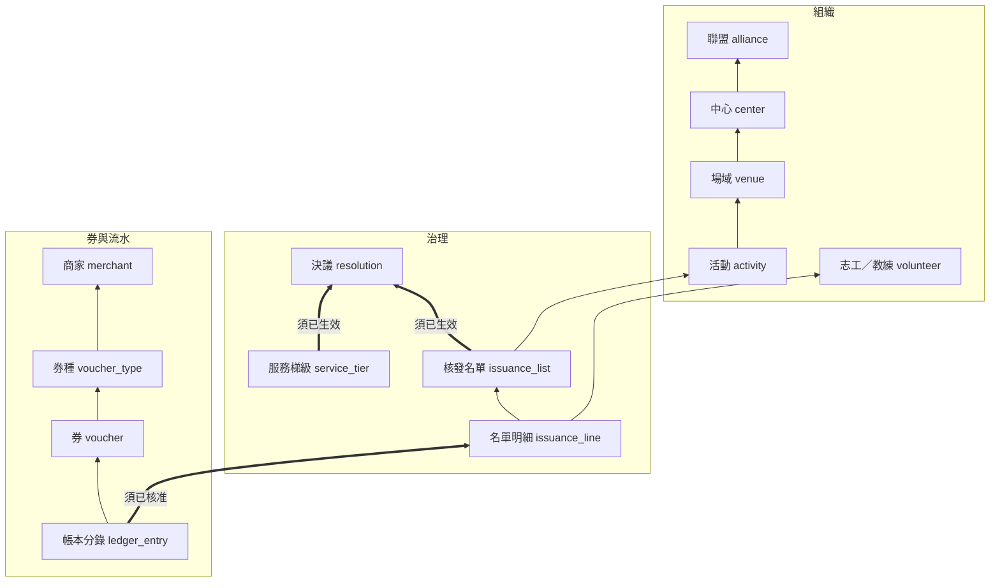

# 菩提幣資料模型（草案）

2026-09-30 草案 · 未經執委會決議 · 線上可編輯版本：[Bodhi Coin Data Model (Draft)](https://claude.ai/code/artifact/699a87ca-717d-4abe-bd00-019be6fcd103)

## 依據與範圍

本草案把 SPEC v2.0（2026-09-06，決策 D22–D49）落成 PostgreSQL 的表、欄位與外鍵；對應開發批次 M2–M5，鏈上合約（M1）不在範圍內。

- **來源**：`specs/SPEC.md` v2.0 與 `specs/PROPOSAL.md` v1.0，取自 9/14「菩提幣」工作階段寫入 geodown-o/bodhi PR #1 時的全文。該 repo 本身這次連不到，若 PR 之後有改動，本稿不會反映。
- **命名**：表與欄位用英文 snake_case，說明用中文；金額欄位一律為整數「幣」，以分為單位存（D28 decimals = 2）。
- **兩條硬規則**（SPEC §5.1、§12）：任何標準變更必須引用「已生效」的決議；任何一筆核發必須引用「已核准」的名單。兩者都用**複合外鍵**在資料庫層強制，做法見〈完整性規則〉。
- **未涵蓋**：RBAC 權限鍵、推播、每日快照格式、鏈上 tx 佇列。這些依附在本模型上，可在定稿後另補。

## 實體總覽



箭頭由引用方指向被引用方。粗線的三條是資料庫強制的來源約束：梯級與名單只能引用已生效的決議，核發分錄只能引用已核准名單裡的一列。圖中省略了志工所屬中心、券的持有人、聯盟單位所屬中心等外鍵，完整清單在下一節。

## 表與欄位

九個主要實體共對應 16 張表；多出來的 activity、issuance_line、committee_seat 等是外鍵要成立所必需的。所有表都有 `created_at`，表中不再列出。

### 組織

**alliance 聯盟**（只有一列）

| 欄位 | 型別 | 約束 | 說明 |
| --- | --- | --- | --- |
| id | smallint | PK | |
| name | text | NOT NULL | 菩提幣聯盟 |
| legal_entity_type | text | NULL，CHECK 協會／基金會／契約聯盟 | Q21 定案前為 NULL |
| total_supply | bigint | NOT NULL | D27 暫定 5 億 × 10² |
| treasury_address | text | NOT NULL UNIQUE | Gnosis Safe 多簽 |

**center 中心**

| 欄位 | 型別 | 約束 | 說明 |
| --- | --- | --- | --- |
| id | uuid | PK | |
| alliance_id | smallint | FK → alliance | |
| name | text | NOT NULL UNIQUE | |
| onchain_address | text | NOT NULL UNIQUE | KMS 保管，在合約白名單內 |
| status | text | active／suspended | |

**venue 場域**

| 欄位 | 型別 | 約束 | 說明 |
| --- | --- | --- | --- |
| id | uuid | PK；UNIQUE (id, center_id) | 供 activity 複合外鍵 |
| center_id | uuid | FK → center NOT NULL | |
| name | text | UNIQUE (center_id, name) | |
| charges_public | boolean | NOT NULL | 是否對外收費（§1.2），Q17、Q18 要用 |
| merchant_id | uuid | FK → merchant NULL | 同一實體也是商家時連過去，帳目仍分開 |

**activity 活動**

| 欄位 | 型別 | 約束 | 說明 |
| --- | --- | --- | --- |
| id | uuid | PK；UNIQUE (id, center_id) | |
| venue_id, center_id | uuid | (venue_id, center_id) FK → venue(id, center_id) | 保證活動的中心就是場域的中心 |
| activity_type | text | NOT NULL | 決定可選哪些梯級 |
| served_period | tstzrange | NOT NULL | 起訖時間 |
| is_paid_public | boolean | NOT NULL | 預設沿用場域，可逐場覆寫 |
| manager_user_id | uuid | FK → app_user | 活動管理員 |
| status | text | 籌備／進行中／已結束 | 名單的狀態放在 issuance_list，不重複存 |

**volunteer 志工／禪修教練**

| 欄位 | 型別 | 約束 | 說明 |
| --- | --- | --- | --- |
| id | uuid | PK | 快照中以假名呈現 |
| user_id | uuid | FK → app_user UNIQUE | 登入帳號 |
| home_center_id | uuid | FK → center NOT NULL | 造冊實名的中心 |
| legal_name | text | NOT NULL | |
| photo_url | text | | 核銷時店員目視核對（D41） |
| is_coach | boolean | NOT NULL | 帶領禪修梯級需教練資格 |
| verified_by, verified_at | uuid, timestamptz | | 中心管理員核可 |
| qr_frozen_at | timestamptz | NULL | 一鍵凍結 |

**merchant 商家**

| 欄位 | 型別 | 約束 | 說明 |
| --- | --- | --- | --- |
| id | uuid | PK | |
| kind | text | alliance_unit／sponsor | |
| center_id | uuid | FK → center NULL；CHECK 聯盟單位必填、贊助商家必空 | 聯盟單位的供應量計入該中心發行額度（D49） |
| name | text | NOT NULL | |
| onchain_address | text | NOT NULL UNIQUE | |
| monthly_cap | bigint | NOT NULL | 每月核銷上限（贊助規模） |
| cap_resolution_id | uuid | 已生效決議外鍵 | 執委會核定上架與額度 |
| status | text | pending／active／suspended | |

### 治理

**resolution 決議**

| 欄位 | 型別 | 約束 | 說明 |
| --- | --- | --- | --- |
| id | uuid | PK；UNIQUE (id, state) | 複合外鍵的目標 |
| number | text | NOT NULL UNIQUE | 例 2026-R-001 |
| kind | text | NOT NULL | tier_table／threshold／parameter／merchant_cap／treasury_topup／other |
| proposer_seat_id | uuid | FK → committee_seat | |
| param_diff | jsonb | NOT NULL | 結構化的參數差異 |
| notice_period | daterange | NULL | 調降梯級須 ≥ 60 天（trigger 檢查） |
| effective_on | date | NOT NULL | |
| state | text | draft／noticed／voting／passed／rejected／effective | effective 後整列凍結 |
| supersedes_id | uuid | FK → resolution NULL | 只能以新決議取代 |
| safe_tx_hash | text | NULL | 合約級參數走多簽時回填 |

**resolution_vote**：PK (resolution_id, seat_id)，vote（yes／no／abstain），voted_at。

**committee_seat 委員席次**

| 欄位 | 型別 | 約束 | 說明 |
| --- | --- | --- | --- |
| id | uuid | PK | |
| center_id | uuid | FK → center NULL | NULL = 聯盟指定席 |
| holder_user_id | uuid | FK → app_user | |
| term | daterange | NOT NULL | Q21 |
| safe_signer_address | text | UNIQUE NULL | 多簽簽署人 |

**service_tier 服務梯級**（一張梯級表 = 同一個決議下的一組列）

| 欄位 | 型別 | 約束 | 說明 |
| --- | --- | --- | --- |
| id | uuid | PK；UNIQUE (id, resolution_id) | |
| resolution_id | uuid | 已生效決議外鍵 | 沒有決議就寫不進來 |
| code | text | UNIQUE (resolution_id, code) | half_day、full_day、retreat_3d… |
| coins | bigint | NOT NULL CHECK > 0 | 志工實拿幣數 |
| nominal_hours | numeric | | 作為佐證對照 |
| requires_coach | boolean | NOT NULL | |
| activity_types | text[] | | 適用活動類型 |

**issuance_list 核發名單**

| 欄位 | 型別 | 約束 | 說明 |
| --- | --- | --- | --- |
| id | uuid | PK；UNIQUE (id, state) | |
| activity_id, center_id | uuid | FK → activity(id, center_id) | |
| version | int | UNIQUE (activity_id, version) | 退回後重建 +1 |
| previous_list_id | uuid | FK → issuance_list NULL | 保留版本鏈 |
| tier_resolution_id | uuid | 已生效決議外鍵 | 造冊時生效的梯級表，不溯及既往 |
| submitted_by | uuid | FK → app_user | |
| state | text | draft／submitted／approved／returned | 送審後明細凍結 |
| total_coins | bigint | | 送審時鎖定 |
| route | text | two／three／meeting | 依分級門檻（D42） |
| threshold_resolution_id | uuid | 已生效決議外鍵 | 門檻本身也是決議 |
| meeting_resolution_id | uuid | NULL；CHECK route = meeting 時必填 | |

**issuance_line 名單明細**

| 欄位 | 型別 | 約束 | 說明 |
| --- | --- | --- | --- |
| id | uuid | PK | |
| list_id, list_state | uuid, text | FK → issuance_list(id, state) ON UPDATE CASCADE | 狀態複製一份，讓排除約束看得到 |
| volunteer_id | uuid | FK → volunteer | |
| tier_id, tier_resolution_id | uuid | FK → service_tier(id, resolution_id) | 只能選名單所用這張表裡的梯級 |
| coins_proposed | bigint | NOT NULL | 系統帶出 |
| coins_approved | bigint | NULL | 委員逐列調整後的值，原值保留 |
| adjusted_by_seat_id, adjust_reason | uuid, text | CHECK 有調整就要有理由 | |
| served | tstzrange | NOT NULL | 實際起訖（佐證） |
| evidence | text | checkin／manual；manual 須填 manual_reason | |

**issuance_approval**：PK (list_id, seat_id)，decision（approve／return），comment，decided_at。

**parameter_value 其他參數**：key（門檻、轉贈上限、單月上限、二次確認面額、D49 係數…），value jsonb，resolution_id（已生效決議外鍵），effective_on。

### 券

**voucher_type 券種**

| 欄位 | 型別 | 約束 | 說明 |
| --- | --- | --- | --- |
| id | uuid | PK | |
| merchant_id | uuid | FK → merchant NOT NULL | |
| kind | text | item／denomination | 品項券／面額券（D47） |
| name | text | NOT NULL | |
| monthly_supply | int | NOT NULL | 每月供應量上限；設定時檢查不超過商家額度 |
| validity_days | int | NOT NULL CHECK > 0 | D46 |
| status | text | draft／listed／delisted／suspended | 抽查不實可暫停 |

**voucher_type_price 券種價格版本**（調價就新增一列，供異常告警追蹤）

| 欄位 | 型別 | 約束 | 說明 |
| --- | --- | --- | --- |
| id | uuid | PK；UNIQUE (id, voucher_type_id) | |
| voucher_type_id | uuid | FK → voucher_type | |
| public_price_twd | bigint | NOT NULL | 對外公開售價（分） |
| face_value | bigint | NOT NULL；CHECK face_value = public_price_twd | D37 平價；Q23 若否定就拿掉這條 CHECK |
| effective_from | timestamptz | NOT NULL | |

**voucher 券**

| 欄位 | 型別 | 約束 | 說明 |
| --- | --- | --- | --- |
| id | uuid | PK | |
| voucher_type_id, price_id | uuid | FK → voucher_type_price(id, voucher_type_id) | 兌換當下的價格 |
| holder_id | uuid | FK → volunteer | 目前持有人 |
| original_holder_id | uuid | FK → volunteer | 兌換人 |
| funding_center_id | uuid | FK → center | 扣幣來源中心，每週結算從這個中心地址付 |
| face_value | bigint | NOT NULL | |
| remaining_value | bigint | CHECK 0 ≤ remaining ≤ face | 面額券可部分核銷 |
| status | text | unredeemed／partial／redeemed／expired_refunded／cancelled | |
| expires_at | timestamptz | NOT NULL | 兌換時寫入 |
| transfer_count | smallint | CHECK ≤ 1 | D44 一張最多轉一次 |

### 流水與輔助表

- **ledger_entry**（只增不改）：kind（issue／exchange／transfer／redeem／expiry_refund／reversal／settle／sweep）、volunteer_id、center_id、coins_delta、voucher_delta、issuance_line_id、list_id + list_state、voucher_id、resolution_id、reverses_entry_id、actor_user_id、tx_hash。
- **volunteer_balance**：PK (volunteer_id, center_id)，coins。依發行中心分帳，原因見下節。
- **voucher_transfer**：voucher_id、from_id、to_id、at。
- **redemption**：voucher_id、store_id、staff_user_id、amount、confirmed_at（高面額二次確認）、settlement_id。
- **settlement ／ sweep**：每週中心→商家、每月商家→金庫，各帶 tx_hash。
- **center_quota**：PK (center_id, quarter)，supply_base、coefficient、cap（D49）。
- **app_user、role_assignment、merchant_store**：登入、四種 scope 的 RBAC、門市與店員。

## 完整性規則

決議與名單的引用用複合外鍵強制：子表把「對方的狀態」也一起存進來，並用 CHECK 鎖死成唯一合法的值，所以草案或未核准的來源在資料庫層就引用不到。

### 決議外鍵

```sql
ALTER TABLE resolution ADD UNIQUE (id, state);

-- 所有「須引用決議」的表都用同一個寫法：
resolution_id    uuid NOT NULL,
resolution_state text NOT NULL DEFAULT 'effective'
                 CHECK (resolution_state = 'effective'),
FOREIGN KEY (resolution_id, resolution_state)
  REFERENCES resolution (id, state) ON UPDATE RESTRICT
```

- 適用：service_tier、parameter_value、merchant.cap_resolution_id、issuance_list 的 tier_resolution_id 與 threshold_resolution_id。
- effective 是終態：每日排程在 effective_on 當天把 passed 轉成 effective，之後 trigger 禁止再改。這對應 SPEC §5.1 的「已通過且已到生效日」。
- 被取代的決議不改狀態，由新決議的 supersedes_id 指回來；「目前生效的梯級表」= 同 kind 中 effective_on 最晚、且未被取代的那一號。

### 名單外鍵

```sql
ALTER TABLE issuance_list ADD UNIQUE (id, state);
ALTER TABLE issuance_line ADD UNIQUE (id, list_id);

-- ledger_entry：kind = 'issue' 的列
CHECK (kind <> 'issue' OR (issuance_line_id IS NOT NULL AND list_id IS NOT NULL)),
list_state text CHECK (list_state IS NULL OR list_state = 'approved'),
FOREIGN KEY (list_id, list_state) REFERENCES issuance_list (id, state),
FOREIGN KEY (issuance_line_id, list_id) REFERENCES issuance_line (id, list_id),
UNIQUE (issuance_line_id)  -- 一列只能入帳一次；沖正走 reverses_entry_id
```

名單核准後由 trigger 凍結明細，入帳金額必須等於該列的 coalesce(coins_approved, coins_proposed)。

### 其他規則與強制方式

| 規則 | 出處 | 強制方式 |
| --- | --- | --- |
| 同一志工同時段不可在兩份名單 | §8.2 | EXCLUDE USING gist (volunteer_id WITH =, served WITH &&) WHERE (list_state <> 'returned') |
| 梯級必須屬於名單所用的梯級表 | §8.2 | 複合 FK (tier_id, tier_resolution_id) |
| 券面額 = 對外售價 | D37 | CHECK |
| 一張券最多轉贈一次 | D44 | CHECK transfer_count ≤ 1 |
| 同一委員不得核可自己送審的名單 | §5.5 | trigger（跨表，FK 做不到） |
| 分級核可人數達標才能轉 approved | D42 | trigger |
| 單人單月上限、每月轉贈／受贈 5 張 | §8.2、§9.4 | trigger，數值讀 parameter_value |
| 調降梯級：公示 60 天、單次 ≤ 20%、12 個月內 ≤ 2 次 | §5.3 | resolution 進入 voting 前的 trigger |
| 券種供應量不超過商家額度 | §9.2 | trigger |
| 中心季度核准總額 ≤ center_quota.cap | D49 | 名單核准時的 trigger |
| 流水只增不改 | §11.1 | REVOKE UPDATE, DELETE；沖正另寫一筆 |

### 帳本恆等式（每日對帳 Job 與 verifier 用）

1. 每個志工：balance = 其 ledger_entry.coins_delta 加總。
2. 每個中心：該中心分帳餘額 + 該中心出資且未核銷的券面額 = 鏈上中心地址餘額 − 已核銷待結算。
3. 全域：所有帳戶負債 + 金庫 + 各中心 + 各商家鏈上餘額 = total_supply。
4. 每張券都有一筆 exchange 來源，以及核銷、轉贈或過期退回的去向。

### 一個設計選擇：餘額依發行中心分帳

> **待確認（未決）**：志工到別的中心服務，幣由服務所在的中心發行並背書（本節的分帳做法），還是應該算在志工自己的所屬中心？

SPEC 要求每個中心的帳戶負債等於其鏈上餘額（§4.4 第 3 點），又禁止中心之間轉幣（§6）。志工在乙中心服務就是由乙中心核發，所以這筆幣必須記在乙中心名下，不能記在志工所屬的甲中心。因此 volunteer_balance 以 (志工, 中心) 分帳，券記錄出資中心。志工畫面只顯示合計；兌換時預設從最早入帳的分帳扣。若一張券需要跨分帳出資，funding_center_id 改成子表 voucher_funding (voucher_id, center_id, amount)。

## 待決問題（Q17–Q23）

Q21 與 Q23 會直接改到 schema；其餘幾題多半只是多加欄位或關掉功能，模型本身不必重做。

| # | 法務問題 | 會動到的表／欄位 | 草案目前的預設 |
| --- | --- | --- | --- |
| Q17 | 志工是否構成勞務關係（打工換宿框架） | activity.is_paid_public、venue.charges_public、volunteer.is_coach、issuance_line.served；若收費活動或教練需另行處理，要加 service_tier.applies_to_paid 之類的欄位 | 先把「收費與否」「教練與否」「實際時數」都存下來；降低幣值只是新決議，不動結構 |
| Q18 | 所得認定、扣繳與憑單、轉贈的贈與稅、收費場域的費用認列 | volunteer 可能要加加密的身分證字號；需要每人每年、依核發中心的彙總報表 | 不存身分證字號；彙總可從 ledger_entry 推出 |
| Q19 | 是否落入多用途支付工具 | 無。模型已不允許幣在志工之間移轉，ledger_entry 沒有對應的 kind | 維持幣不可轉讓（D30） |
| Q20 | 券是否構成商品（服務）禮券 | voucher_transfer 整張表、voucher.transfer_count、expires_at 與過期退回；若改由商家自行發券，voucher 要加 issuer；若須履約保證，merchant 要加保證欄位 | 轉贈做成參數開關；券的發行人視為聯盟 |
| Q21 | 執委會席次、法定人數、表決門檻、任期；聯盟法律主體；多簽簽署人怎麼對應席次 | committee_seat、resolution_vote、alliance.legal_entity_type；法定人數與門檻要進 parameter_value。還有雞生蛋問題：第一批席次與第一張梯級表沒有決議可引用 | 先照 SPEC 建議：每中心 1 席加聯盟指定 2 席；用一筆 kind = founding 的創始決議收容初始參數 |
| Q22 | 首波成員、商家每月可承受規模、活動人數與頻率 | 影響種子資料與 alliance.total_supply、merchant.monthly_cap、center_quota，不動結構 | total_supply 暫定 5 億 |
| Q23 | 1:1 平價若不可行，改回相對對價 | voucher_type_price 的 CHECK 拿掉；券價改由執委會核定，要加 voucher_type_price.resolution_id；報表不能再把幣當台幣讀 | 平價寫成單一一條 CHECK，退路只是一次 migration |

### 非法務、但定稿前要拍板

- 餘額依發行中心分帳（上一節）是否符合各中心對「誰承擔這筆幣」的理解。**未決。**
- 志工登入方式與推播管道（手機、Email 或 LINE），決定 app_user 的欄位。
- 核發沖正可能讓餘額為負（§9.7），所以 volunteer_balance.coins 沒有加 ≥ 0 的 CHECK；兌換時另檢查餘額。
