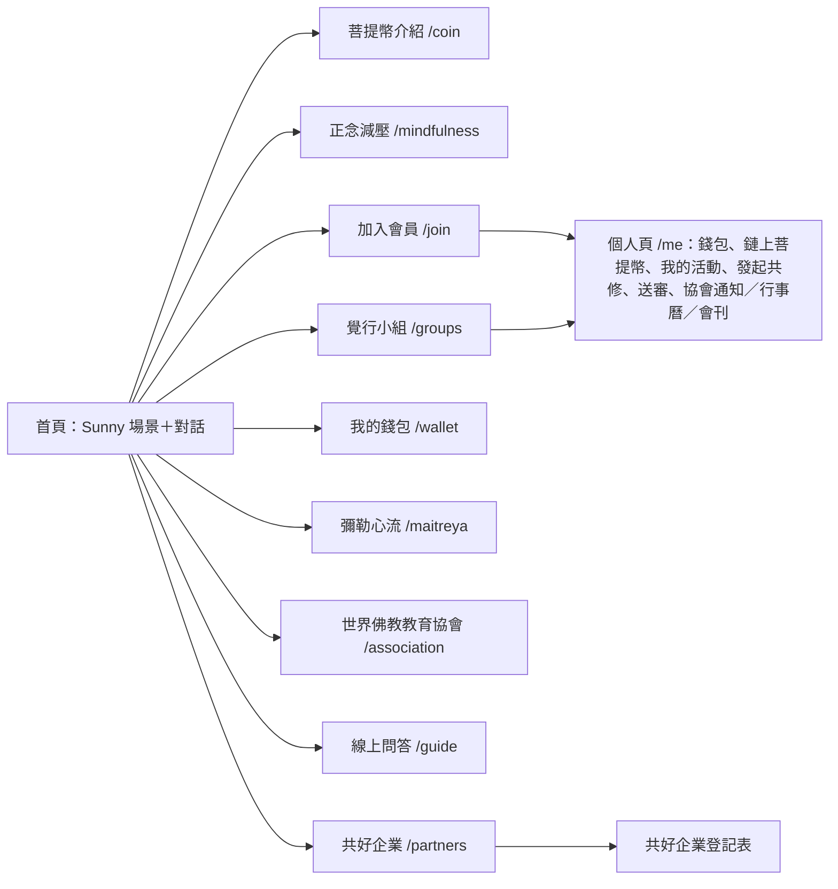

# 1. 系統總覽

## 1.1 目的

Sunny life 是世界佛教教育協會（WEBA）菩提幣系統的官方網站與後端：

1. **對外介紹**：菩提幣、正念減壓、覺行小組、共好企業、彌勒心流、世界佛教教育協會。
2. **會員與共修**：一套共用的「系統會員」，可選擇加入覺行小組、世界佛教教育協會或兩者；覺行小組會員可發起、參加、協助共修活動。
3. **菩提幣**：協助共修的志工與減壓教練，活動結束後送審，超級管理員核准即入帳（站內帳本）；入會贈幣 1 枚在 Polygon 主網上鏈。
4. **線上覺行小組組長 Sunny**：首頁與「線上問答」頁 3D 場景中的 AI 角色，依後台上架的知識回答問題、帶領共修，並以語音唸出回答。
5. **管理後台**：報名與登記、場域、共好企業、覺行小組、菩提幣審核、協會內容與行事曆、會員名冊、Sunny 知識庫與訓練設定、帳號。

## 1.2 名詞

| 用語 | 定義 |
| --- | --- |
| 系統會員 | 在官網註冊的人。資料表 `volunteer`（歷史名稱）＋ `app_user`。必填實名、email、密碼；暱稱、電話、LINE 選填 |
| 覺行小組 | 隨興或定期相約一起做正念減壓的小組活動；任何會員可發起，三人以上即成立一次活動 |
| 共修活動 | 一次覺行小組活動（`practice_event`），可指定在後台登錄的「活動場域」 |
| 協辦志工／減壓教練 | 活動中以 `helper` 身分協助的人，與發起人一起是菩提幣的受領人 |
| 菩提幣 | 服務時數換得的點數。站內帳本記整數枚；鏈上 ERC-20 `BODHI` 小數 2 位、總量 5 億 |
| 共好企業 | 提供兌換、接受菩提幣的場所（原 SPEC 稱聯盟單位／贊助商家）。對外一律用「共好企業」 |
| 菩提幣決策小組 | 世界佛教教育協會菩提幣決策小組（SPEC 的執委會）。目前在會員名冊上是標籤，沒有額外權限 |
| 超級管理員 | 後台最高角色（代碼 `alliance_admin`，舊稱聯盟管理員） |
| Sunny | 線上覺行小組組長，AI 角色；自稱「我是線上覺行小組組長Sunny」 |
| 中心／場域 | 中心（`center`）是組織單位；場域（`venue`）是中心底下可辦活動的地點 |

## 1.3 功能地圖

| 選單 | 公開內容 | 登入後 |
| --- | --- | --- |
| 菩提幣介紹 | 理念、怎麼得幣、梯級表、鏈上查詢（PolygonScan 說明、合約資訊） | — |
| 正念減壓 | 八週課程（法源法師審定編輯）、各週講義、上座與下座 | — |
| 覺行小組 | 定義、後台登錄的活動場域、近期活動 | 在場域報名或發起共修 |
| 共好企業 | 招募說明、登記表 | — |
| 我的錢包 | 說明 | 導向個人頁的餘額與流水 |
| 彌勒心流 | 原理（法源法師止觀）、唯識三轉 | — |
| 世界佛教教育協會 | 協會簡介、任務、核心共識、邀請加入 | 協會會員看通知、行事曆、會刊 |
| 線上問答 | Sunny 全畫面場景、對話、帶我共修 | — |
| 頁尾 | 「一即一切，一切即一」、隱私權保護聲明 `/privacy` | — |

`/committee`（主辦審核小組）頁面保留但不在選單上。

## 1.4 角色

| 角色 | 識別方式 | 能做的事 |
| --- | --- | --- |
| 訪客 | 未登入 | 瀏覽公開頁、與 Sunny 對話、送出共好企業登記與小組報名 |
| 系統會員 | `app_user` 無角色＋`volunteer` 列 | 個人資料、切換覺行小組／協會身分、發起／參加／協助活動、送審、看錢包與鏈上幣、協會內容 |
| 覺行小組長 | `volunteer.is_group_leader` | 會員身分標記（後台打勾）；各小組的組長在後台覺行小組頁設定 |
| 減壓教練 | `volunteer.is_coach`；申請中 = `wants_coach` 且未勾 | 會員身分標記 |
| 決策小組成員 | `volunteer.is_committee` | 會員身分標記，無額外權限 |
| 中心管理員 | `role_assignment(center_admin, center:{id})` | 後台「會員名冊」，只看自己中心 |
| 知識管理員 | `role_assignment(knowledge_manager, guide)` | 後台「知識庫」「Sunny訓練設定」 |
| 超級管理員 | `role_assignment(alliance_admin, alliance)` | 後台全部功能，含菩提幣審核與帳號管理 |

## 1.5 目前範圍與未做

已上線：官網全部選單、會員註冊登入、覺行小組活動與菩提幣送審核發（站內帳本）、協會會員內容與行事曆、Sunny 對話／帶領共修／語音／3D 場景、知識庫後台、入會贈幣上鏈（Polygon 主網）、自訂網域。

未做（見第 10 章）：決策小組提案表決（M3）、核發名單分級審核（M4 完整版）、共好企業券與兌換核銷（M5）、協助共修所得菩提幣上鏈、每日帳本錨定、Email 通知。
