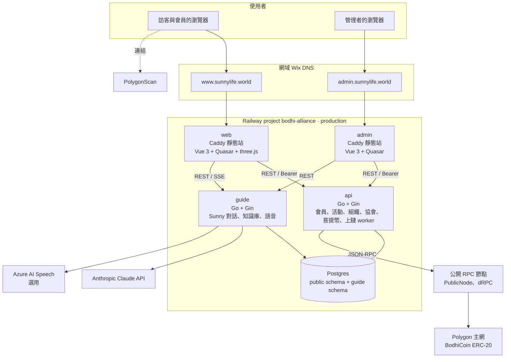

# 2. 系統架構

## 2.1 全系統元件



| 元件 | 原始碼 | 執行 | 職責 |
| --- | --- | --- | --- |
| web | `apps/web` | `apps/Dockerfile`（`APP=web`），Caddy 提供 SPA | 官網、會員個人頁、Sunny 3D 場景與語音播放 |
| admin | `apps/admin` | `apps/Dockerfile`（`APP=admin`） | 管理後台 |
| api | `server/cmd/api` | `server/Dockerfile`（`SERVICE=api`），distroless | 登入與帳號、會員、覺行小組與活動、菩提幣審核與帳本、組織（中心、場域、共好企業）、報名與登記、協會內容、上鏈 worker |
| guide | `server/cmd/guide` | `server/Dockerfile`（`SERVICE=guide`） | Sunny 對話（串流）、帶領共修、知識庫、角色設定、用量與預算、語音合成代理 |
| Postgres | Railway 外掛 | — | 唯一資料庫；api 與 guide 共用，guide 只寫 `guide.*` schema |

### 為何 Sunny 是獨立服務

Sunny 要呼叫外部模型、處理上傳檔案，故障或費用暴增時要能單獨關掉（後台「Sunny訓練設定」可關閉對話或設月預算），不能拖垮會員與帳本 API。兩個服務共用登入（同一張 `user_session`）與資料庫遷移，但各自編譯、各自部署。

## 2.2 技術棧

| 層 | 採用 | 版本（main） |
| --- | --- | --- |
| 後端語言與框架 | Go + Gin | Go 1.26 |
| 資料庫驅動 | pgx v5（pgxpool） | — |
| 資料庫 | PostgreSQL | 16 |
| 前端 | Vue 3 + TypeScript + Vite + Quasar 2 + vue-router | Vue 3.5、Vite 8、Quasar 2.34 |
| 3D | three.js + @pixiv/three-vrm | three 0.186 |
| 靜態檔伺服器 | Caddy 2（`apps/Caddyfile`，SPA 回 `index.html`，`/assets/*` 長快取） | — |
| AI | Anthropic Messages API（預設模型 `claude-opus-5-5`，`GUIDE_MODEL` 可換） | — |
| 語音 | Azure AI Speech 神經語音（選用）；退回瀏覽器 Web Speech API | — |
| 區塊鏈 | Solidity 0.8.28 + OpenZeppelin；go-ethereum 客戶端 | Polygon PoS 主網（chain 137） |
| 部署 | Railway（Docker 建置、`main` 自動部署） | — |
| CI | GitHub Actions（`.github/workflows/ci.yml`） | — |

## 2.3 Repo 結構（單一 repo）

```
bodhi-alliance/
  apps/
    web/            官網（含 /me 個人頁、Sunny 場景 src/guide3d、語音 src/voice.ts）
    admin/          管理後台
    shared/calendar 官網與後台共用的行事曆元件（移植自 dengo）
    Dockerfile      建 web 或 admin（APP 參數）
    Caddyfile
  server/
    cmd/api/        核心 API 進入點（含整合測試）
    cmd/guide/      Sunny 服務進入點
    internal/
      auth/         登入、Bearer session、角色檢查、帳號管理
      members/      會員註冊、個人資料、身分切換、會員名冊
      apply/        覺行小組（practice_group）、小組報名、共好企業登記
      org/          中心、場域、共好企業
      events/       共修活動、參加、送審、菩提幣審核、錢包
      association/  協會通知、行事曆、會刊、協會會員
      chain/        BodhiCoin ABI/bytecode、上鏈 worker、/api/chain
      guide/        Sunny：對話、檢索、知識庫、種子、語音
      db/           連線與內嵌遷移 migrations/*.sql
      httpx/        CORS、限流、healthz
      config/       環境變數
      testdb/       測試用暫時資料庫
    Dockerfile
  contracts/        BodhiCoin.sol 與建置腳本（輸出到 server/internal/chain）
  docs/             本規格書（docs/spec）與 SPEC 目標資料模型
  index.html        舊招募頁（GitHub Pages），已由正式站取代
  docker-compose.yml 本機開發：db + api + guide
```

## 2.4 請求流程

**會員登入**：`POST /api/auth/login` → bcrypt 比對 → 產生 32 位元組隨機 token，資料庫只存 SHA-256（`user_session.token_hash`），有效 7 天 → 前端存在 `localStorage`（官網與後台分開）→ 之後每個請求帶 `Authorization: Bearer <token>`。guide 服務用同一張表驗證後台使用者。

**Sunny 對話**：瀏覽器 `POST {guide}/guide/chat`（`Accept: text/event-stream`）→ guide 組系統提示（角色設定＋回答方式＋知識）→ Claude API 串流 → 逐段以 SSE 回傳 → 前端每湊滿一句就呼叫 `/guide/tts` 或瀏覽器語音唸出。

**菩提幣核發**：發起人在活動結束後送審（`coin_claim`）→ 超級管理員在後台核准並可調整每人金額 → 同一交易寫入 `claim_recipient` 與 `coin_ledger`（站內帳本）。

**入會贈幣上鏈**：api 內的背景 worker 每 20 秒檢查還沒有鏈上地址或贈幣的會員 → 由種子推導地址 → 金庫轉 1.00 BODHI → 等確認後寫回 `chain_grant`。

## 2.5 安全設計

| 面向 | 做法 |
| --- | --- |
| 密碼 | bcrypt（預設 cost），至少 10 字元 |
| Session | 隨機 token，只存雜湊；7 天到期；登出即刪 |
| 授權 | 每條路由用 `Require(role, scope)`、`RequireUser()`、`RequireCenterStaff()` 中介層；超級管理員視為擁有所有角色 |
| CORS | 只允許 `ALLOWED_ORIGINS` 列出的前端網址 |
| 限流 | 每 IP 令牌桶（`httpx.RateLimit`）：登入 10/30 秒、註冊 5/分、報名與登記 5/分、Sunny 對話 20/30 秒、語音 40/3 秒；`TRUSTED_PROXIES` 決定是否採信 `X-Forwarded-For` |
| 防機器人 | 公開表單有 honeypot 欄位（`website`） |
| 資料庫 | 外鍵與 CHECK 約束；遷移以 advisory lock 防止兩個服務同時執行 |
| 容器 | distroless、非 root 使用者執行 |
| 祕密 | 全部放 Railway 服務變數；repo 只有 `.env.example` 的假值（第 9 章） |
| 鏈上金鑰 | 營運私鑰與會員種子只在 api 的環境變數；會員私鑰不落地，每次由種子推導 |
| Sunny 隔離 | 不讀寫帳本與會員表；問到餘額只引導到個人頁 |
