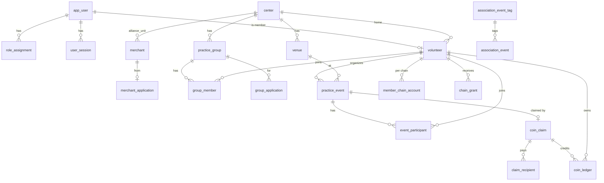

# 4. 資料模型

單一 PostgreSQL 16 資料庫。核心表在 `public` schema（api 讀寫），Sunny 的表在 `guide` schema（guide 讀寫）。所有主鍵為 `uuid`（`gen_random_uuid()`），時間欄位為 `timestamptz`。

## 4.1 遷移

遷移檔內嵌在執行檔（`server/internal/db/migrations/*.sql`），api 與 guide 啟動時依檔名順序執行尚未記錄在 `schema_migration` 的檔案；以 `pg_advisory_lock(724201002)` 確保同時只有一個服務在遷移。**已上線的遷移檔不可修改，改動一律新增檔案。**

| 檔案 | 內容 |
| --- | --- |
| 001_core.sql | 帳號、角色、session、覺行小組、小組報名、共好企業登記 |
| 002_guide.sql | `guide` schema：知識文件、版本、段落、角色設定、用量、設定 |
| 003_org.sql | 中心、共好企業、場域；小組加 `center_id` |
| 004_members.sql | 會員（`volunteer`）、小組成員、中心管理員角色 |
| 005_super_admin_name.sql | 聯盟管理員 → 超級管理員（顯示名稱） |
| 006_events.sql | 共修活動、參加者、送審、受領人、站內帳本；會員加 LINE、所屬中心改選填 |
| 007_event_venue.sql | 活動可指定場域 |
| 008_association.sql | 會員身分（覺行小組／協會）、協會會刊、行事曆、通知 |
| 010_group_leader.sql | 會員「覺行小組長」 |
| 011_committee.sql | 會員「菩提幣決策小組」 |
| 012_chain.sql | 鏈上設定、會員鏈上地址、入會贈幣 |
| 013_chain_per_network.sql | 會員在每條鏈各有一個地址 |
| 014_calendar.sql | 行事曆類型與標籤 |

（編號 009 未使用。）

## 4.2 關聯圖

## 4.3 帳號與權限

**app_user**：`id`、`email`（唯一，小寫）、`display_name`、`password_hash`（bcrypt）、`disabled_at`、`created_at`。後台人員與會員共用。

**role_assignment**：`(user_id, role, scope)`。

| role | scope | 說明 |
| --- | --- | --- |
| `alliance_admin` | `alliance` | 超級管理員 |
| `knowledge_manager` | `guide` | 知識管理員 |
| `center_admin` | `center:{uuid}`（CHECK 檢查格式） | 中心管理員 |

**user_session**：`token_hash`（SHA-256，主鍵）、`user_id`、`expires_at`（7 天）。

## 4.4 組織

| 表 | 主要欄位 | 說明 |
| --- | --- | --- |
| `center` | name（唯一）、region、address、聯絡人、status `active/suspended` | 中心 |
| `venue` | center_id、name、address、description、charges_public、merchant_id、status `active/closed` | 活動場域，覺行小組頁列出 |
| `merchant` | kind `alliance_unit/sponsor`、center_id、name、聯絡資料、offerings、proposed_monthly_cap、status `pending/active/suspended`、application_id | 共好企業 |
| `merchant_application` | kind `center/sponsor/other`、org_name、聯絡資料、offerings、monthly_scale、status `new/contacted/accepted/declined`、admin_note | 共好企業登記表 |
| `practice_group` | name、region、center_id、schedule、description、is_online、is_listed、sort_order | 覺行小組（固定小組） |
| `group_application` | group_id、name、email、phone、region、wants_coach、status、admin_note | 小組報名（舊表單） |

## 4.5 會員

**volunteer**（系統會員；表名沿用 SPEC 的志工）

| 欄位 | 說明 |
| --- | --- |
| user_id | 對應 `app_user`，一對一 |
| legal_name | 實名（必填） |
| phone、line_id、photo_url | 選填 |
| home_center_id | 所屬中心（選填） |
| wants_coach / is_coach | 申請教練 / 已是教練 |
| is_group_leader | 覺行小組長 |
| is_committee | 菩提幣決策小組成員（標籤） |
| status | `pending/verified/rejected`；`verified_by`、`verified_at`、`review_note` |
| qr_frozen_at | 凍結（預留給 M5 身分 QR） |
| in_groups / in_association / association_joined_at | 會員身分，至少一個為真（由 API 檢查） |

**group_member**：`(group_id, volunteer_id)`、role `member/leader`。

## 4.6 共修活動與菩提幣（站內帳本）

| 表 | 主要欄位 | 規則 |
| --- | --- | --- |
| `practice_event` | organizer_id、title、is_online、location、starts_at、ends_at、capacity（3–500）、description、venue_id、status `open/cancelled` | 只有發起人能取消，已送審的不能取消 |
| `event_participant` | (event_id, volunteer_id)、role `organizer/helper/participant` | |
| `coin_claim` | event_id（唯一）、submitted_by、attendance（≥3）、report、status `submitted/approved/rejected`、review_note、reviewed_by、reviewed_at | 一場活動只能送審一次 |
| `claim_recipient` | (claim_id, volunteer_id)、role `organizer/helper`、amount | 核准時寫入，可由審核者調整 |
| `coin_ledger` | volunteer_id、amount（整數枚）、kind `issue`、claim_id、memo | 錢包餘額 = 加總；只增不改 |

**建議金額**（`events.SuggestedAmount`，菩提幣介紹頁的初始梯級）：未滿 4 小時每小時 300 枚（至少 1 小時）、滿 4 小時 1,500 枚、滿 8 小時 3,000 枚。

## 4.7 世界佛教教育協會

| 表 | 主要欄位 |
| --- | --- |
| `association_notice` | title、body |
| `association_issue`（會刊） | title、issued_on、summary、url |
| `association_event`（會員行事曆） | title、starts_at、ends_at、location、description、kind `general/training/meeting/activity/ceremony`、tag_id |
| `association_event_tag` | name（唯一）；刪標籤不刪行程 |

## 4.8 區塊鏈

| 表 | 主要欄位 | 說明 |
| --- | --- | --- |
| `chain_setting` | key、value | `contract:{chainId}` 合約地址、`deploy_tx:{chainId}` 部署中的交易 |
| `member_chain_account` | (volunteer_id, chain_id)、address | 平台保管的會員地址 |
| `chain_grant` | volunteer_id、chain_id、kind `join`、amount（最小單位，100 = 1 枚）、to_address、status `pending/sent/confirmed/failed`、tx_hash、block_number、last_error、sent_at、confirmed_at | 入會贈幣；舊鏈（Amoy）紀錄保留 |

## 4.9 Sunny（`guide` schema）

| 表 | 主要欄位 | 說明 |
| --- | --- | --- |
| `guide.document` | title、category `practice/script/coin/association/faq`、status `draft/published/archived`、current_version、uploaded_by | 知識文件；`script` 類是共修腳本 |
| `guide.document_version` | (document_id, version)、source_name、body、edited_by | 每次修改一個版本 |
| `guide.chunk` | (document_id, seq)、heading、body | 上架版本切成約 600 字的段落 |
| `guide.persona_version` | version、name、prompt、edited_by | 角色設定歷史 |
| `guide.usage` | model、input/output/cache_read/cache_write tokens | 每次呼叫的用量 |
| `guide.setting` | key、value | `chat_enabled`（預設 true）、`monthly_budget_usd`（預設 50）、`seed:<檔名>`、`seed:persona` |

## 4.10 SPEC 目標模型

SPEC v2.0 的決議、梯級、核發名單、券、帳本分錄等表尚未建立；設計見 [../data-model.md](../data-model.md)。實作時需和本章的 `coin_claim`／`coin_ledger` 整併（第 10 章）。
