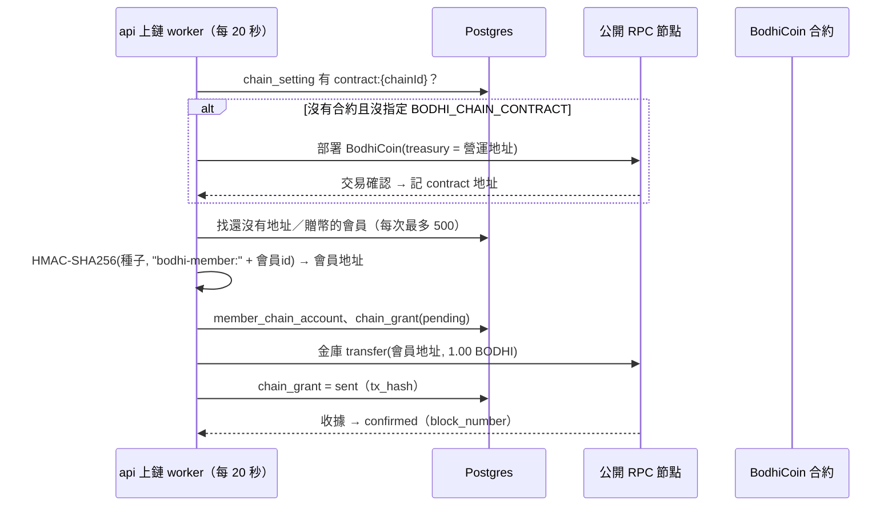

# 6. 菩提幣上鏈

## 6.1 現況（2026-10-09）

| 項目 | 狀態 |
| --- | --- |
| 網路 | Polygon PoS 主網（chain 137），`BODHI_CHAIN_NETWORK=polygon` |
| 營運地址＝金庫 | `0xA32c80dB53945A42F8a34005aD84681c436b875a` |
| 主網合約 | **尚未部署**：api 日誌每 20 秒顯示 `deploy: estimate gas: insufficient funds`，等營運地址收到 POL（建議約 5 POL）後自動部署並開始發入會贈幣 |
| 測試鏈紀錄 | Amoy（chain 80002）合約 `0xD29Df7315dB8b9127949233EeB73Ea0e9d29F03D`，2026-10-08 上線；資料庫保留 Amoy 的地址與贈幣紀錄，個人頁只顯示目前這條鏈 |
| 節點容錯 | PR #60（尚未合併）：節點回 HTTP 錯誤或逾時時自動換下一個 |

## 6.2 設計

- **一筆確認後再送下一筆**，nonce 不會亂；節點 10 分鐘都不認得的交易視為掉單，重新送。
- **手續費**：主網小費下限 30 gwei，單位 gas 超過 500 gwei 時暫停，等回落再送。
- **會員私鑰不儲存**：每次由 `BODHI_CHAIN_MEMBER_SEED` 與會員 id 推導。種子遺失就無法替會員簽名；換種子則會員地址全部改變。
- **協助共修所得的菩提幣仍在站內帳本 `coin_ledger`，尚未上鏈。**

## 6.3 合約 `contracts/BodhiCoin.sol`

| 項目 | 內容 |
| --- | --- |
| 標準 | ERC-20（OpenZeppelin 5）＋ Ownable，Solidity 0.8.28 |
| 名稱／代號 | 菩提幣 / BODHI |
| 小數 | 2（1 枚 = 100 最小單位） |
| 總量 | 5 億枚，部署時全數鑄給金庫，不可增發 |
| 轉帳限制 | 只有「機構地址」（金庫、營運地址，之後的中心與共好企業）能收發；兩邊都不是機構地址的轉帳一律 revert（`PersonalTransferNotAllowed`），所以**會員之間不能互轉** |
| 管理 | `setInstitutional(address, bool)`，只有 owner（營運地址）能呼叫；決策小組通過後才把中心、共好企業加入 |

建置：`cd contracts && npm ci && npm run build`，輸出 `server/internal/chain/BodhiCoin.abi.json` 與 `BodhiCoin.bin`，由 Go 內嵌。

## 6.4 設定（api 服務環境變數）

| 變數 | 預設 | 說明 |
| --- | --- | --- |
| `BODHI_CHAIN_NETWORK` | `amoy` | `amoy` 或 `polygon`；決定預設節點、區塊瀏覽器，並檢查節點的 chain id |
| `BODHI_CHAIN_OPERATOR_KEY` | 空＝關閉 | 營運地址私鑰（祕密，見第 9 章） |
| `BODHI_CHAIN_MEMBER_SEED` | 空＝關閉 | 會員地址推導種子，32 位元組以上 hex（祕密） |
| `BODHI_CHAIN_RPC` | 依網路三個公開節點 | 逗號分隔；連不上時每分鐘重試 |
| `BODHI_CHAIN_EXPLORER` | `https://polygonscan.com`（主網） | 個人頁與介紹頁的連結 |
| `BODHI_CHAIN_CONTRACT` | 空＝自動部署 | 指定既有合約 |

兩把祕密都設了才啟用；未啟用時 `/api/chain` 回 `enabled: false`，個人頁不顯示鏈上區塊。

## 6.5 費用估算

模擬鏈量測：部署約 130 萬 gas、每筆贈幣上限約 15 萬 gas。以 50 gwei 計：部署約 0.065 POL，每位會員約 0.0075 POL；5 POL 約可部署並發給 600 位以上會員。

## 6.6 與 SPEC 的差異

SPEC v2.0 D33 原設計「會員沒有個人鏈上地址，只錨定帳本雜湊」。2026-10-08 Geodown 決定入會贈幣上鏈、每位會員有平台保管的地址，並同意上主網。SPEC 的 KMS 簽章服務、Gnosis Safe 多簽金庫、每日帳本錨定（LedgerAnchor）、verifier CLI 尚未實作（第 10 章）。法務問題 Q19（多用途支付工具）仍待確認。
