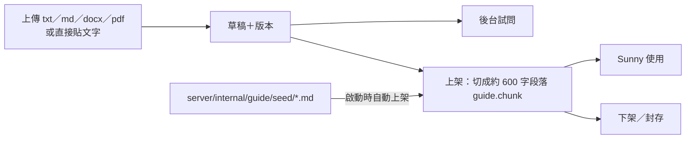

# 7. 線上覺行小組組長 Sunny

Sunny 是 `guide` 服務（`server/cmd/guide`、`server/internal/guide`）加上官網的 3D 場景與語音（第 3 章）。

## 7.1 能力與界線

| 能力 | 做法 |
| --- | --- |
| 問答 | 只依已上架的知識回答覺行、共修、正念減壓、彌勒心流、菩提幣、協會與官網操作；查不到就說查不到並引導到覺行小組頁 |
| 帶我共修 | `practice` 模式依「共修腳本」（知識庫 `script` 類）一步一步帶，一次一個步驟 |
| 語音 | 回答逐句唸出（Azure 神經語音或瀏覽器語音） |
| 自我介紹 | 「我是線上覺行小組組長Sunny」 |
| 不做 | 查詢或修改餘額、價格或收益預測、醫療或心理診斷；提到自傷時提供安心專線 1925、生命線 1995、119／110 |

## 7.2 提示組成

每次呼叫 Claude API 的系統提示依序為：

1. **角色設定**（persona）：後台「Sunny訓練設定」編輯，有版本紀錄；預設內容在 `chat.go` 的 `DefaultPersonaPrompt`。
2. **回答方式**（`replyStyle`，寫在程式裡，不受後台改動影響）：一般 1–3 句、80 字內；口語、不用條列與符號（因為會唸出來）；結尾用一句變化的問句邀請互動。
3. **知識**：已上架文件的段落，**加上 prompt cache 斷點**，重複提問便宜。
   - 全部知識 ≤ 15 萬字：整份放入。
   - 超過時：依最新問題以中文雙字詞比對挑出最相關的 12 段（`retrieve.go`），不需嵌入模型。
4. **共修腳本**（只在 practice 模式，放在快取斷點之後）。

呼叫參數：模型 `GUIDE_MODEL`（預設 `claude-opus-5-5`）、`max_tokens` 4096、effort medium、串流、安全拒答時自動改由備援模型續答。歷史最多 20 則。

## 7.3 知識庫

**內建知識（seed）**：`server/internal/guide/seed/` 下的 Markdown，檔頭有 `title`、`category`。

| 檔案 | 內容 |
| --- | --- |
| `coin.md` | 菩提幣與共好企業（只放可公開的內容） |
| `groups.md` | 覺行小組定義、發起與協助、菩提幣審核 |
| `association.md` | 世界佛教教育協會（來源：36 頁協會介紹 PDF 與協會簡介 docx） |
| `mindfulness.md`、`mindfulness-lessons.md`、`sitting.md` | 正念減壓八週課程、各週內容、上座與下座 |
| `maitreya.md` | 彌勒心流（法源法師止觀）、唯識三轉 |

規則：服務第一次看到某檔時自動上架；之後檔案有改、而後台沒人改過那份文件時，自動帶入新內容（`guide.setting` 的 `seed:<檔名>` 記文件 id 與內容雜湊）。後台修改、下架或封存後，重新部署不會覆蓋。**要讓 Sunny 知道新東西，最簡單是新增或修改 seed 檔並合併到 main。**

## 7.4 費用控管

- 每次呼叫記錄 token 用量（`guide.usage`），依模型單價估算本月（UTC）費用；快取讀取以 0.1 倍、寫入以 1.25 倍輸入價計。
- `monthly_budget_usd` 預設 50 美元；超過或 `chat_enabled=false` 時前台顯示休息中，語音也一併停用。
- 沒設 `ANTHROPIC_API_KEY` 時對話關閉，知識庫後台照常可用。

## 7.5 語音

| 項目 | 內容 |
| --- | --- |
| 雲端語音 | Azure AI Speech，`AZURE_SPEECH_KEY`＋`AZURE_SPEECH_REGION`（預設 `eastasia`），聲音 `TTS_VOICE`（預設 `zh-TW-HsiaoChenNeural`），語速 `TTS_RATE`；輸出 24kHz mp3 |
| 目前狀態 | 依專案紀錄，截至 2026-10-08 **金鑰尚未設定**，網站使用瀏覽器內建語音 |
| 讀音修正 | `apps/web/src/voice.ts` 只替換唸出的文字（例如「覺行」唸 jué xíng），畫面不變 |
| 限制 | 一次最多 300 字；每 IP 40 次／3 秒 |

## 7.6 角色與場景

3D 角色、場景時刻表、素材授權見第 3.2 節。被提問時角色睜眼、鏡頭推近；回答時依語音對嘴，結束後回到冥想。
