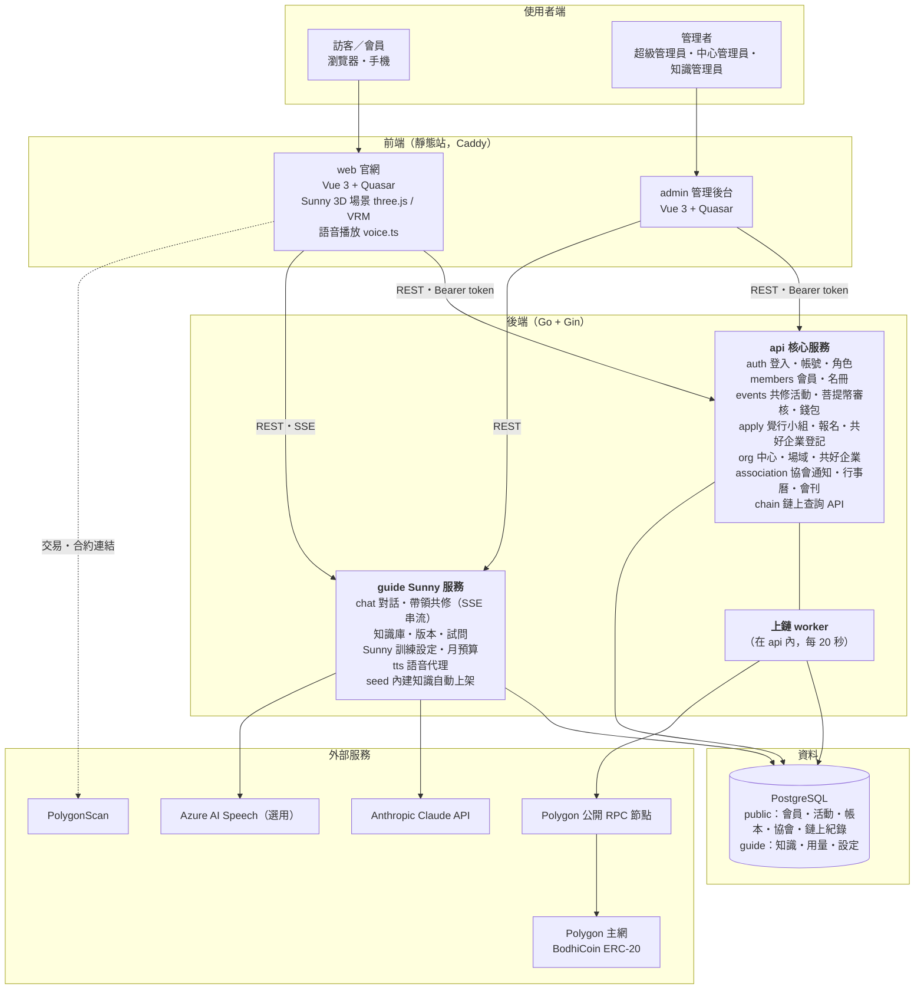
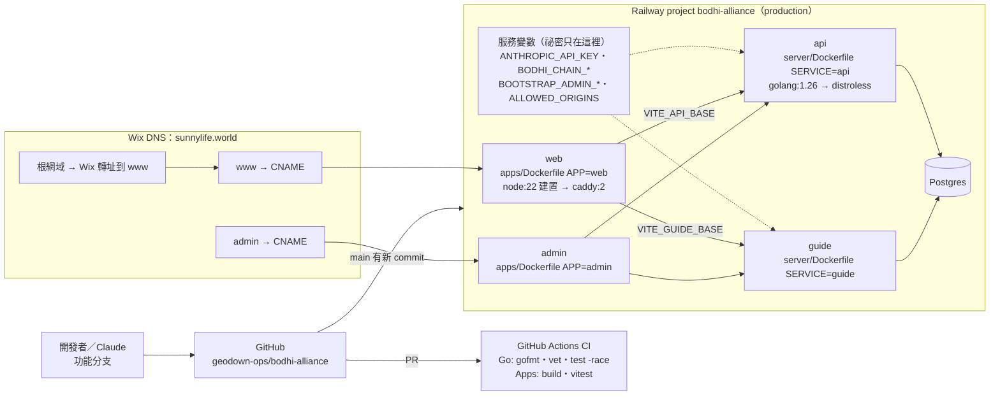
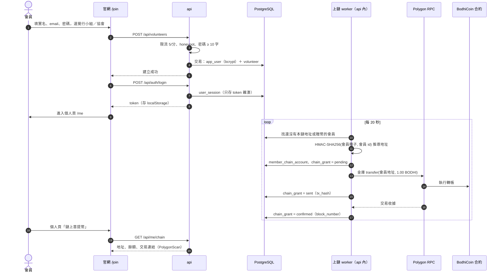
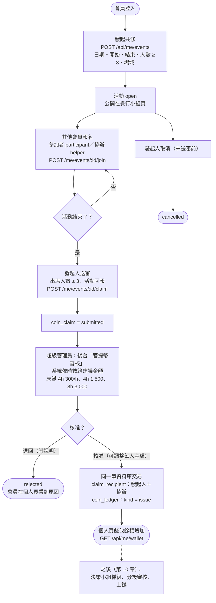
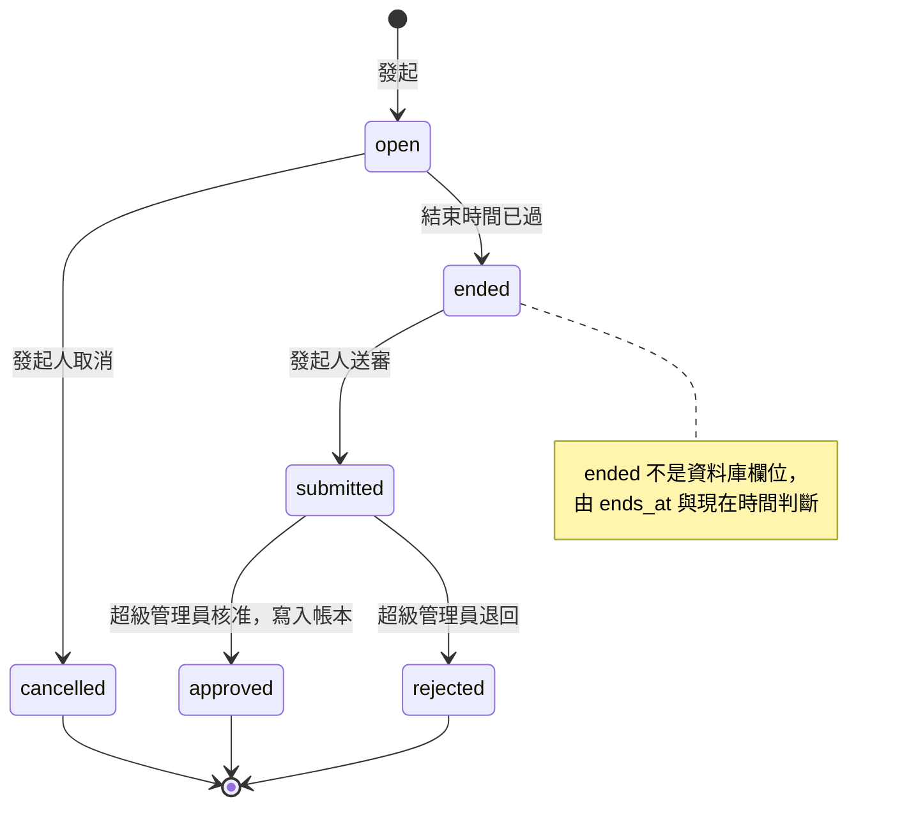
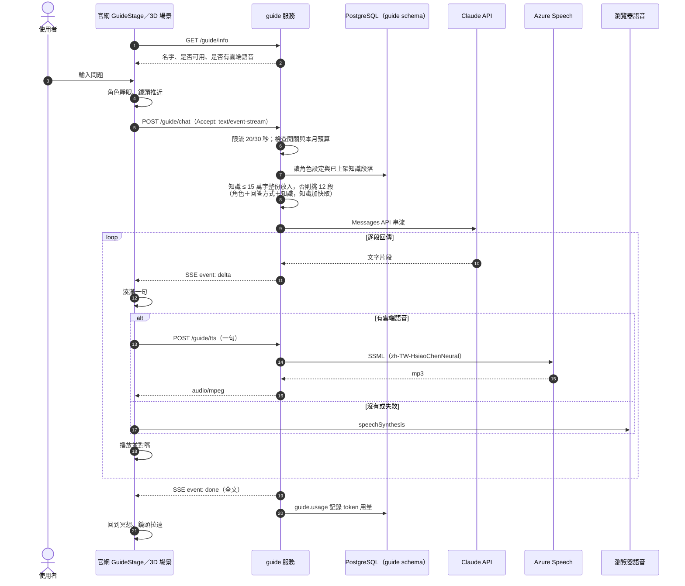
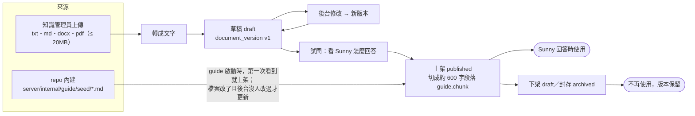
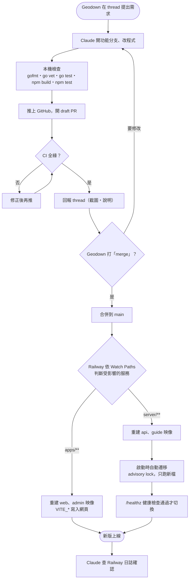
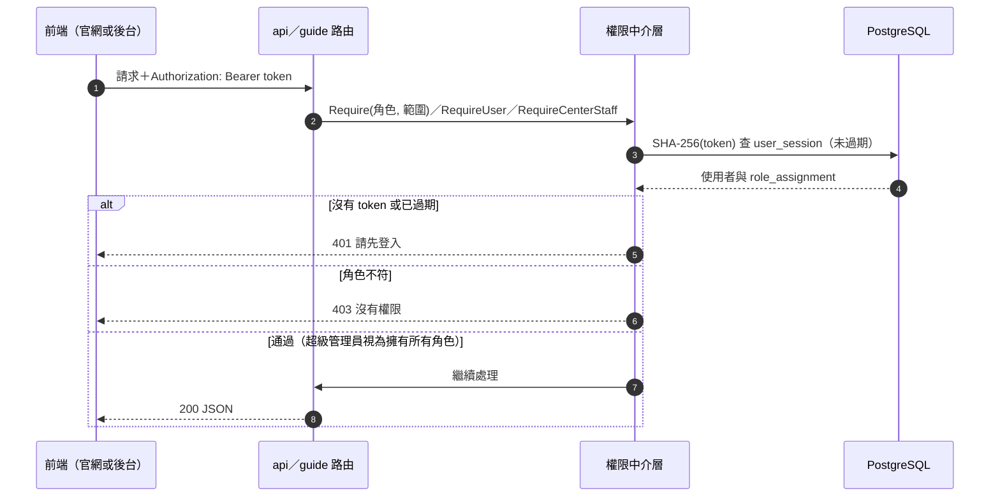

# 11. 服務架構圖與流程圖

本章集中放全系統的架構圖與主要流程圖，以 Mermaid 撰寫（GitHub 直接顯示）。同一組圖另有 PNG／SVG 版本放在專案檔案 `spec/diagrams/`。各章另有局部的圖。

| 圖 | 內容 |
| --- | --- |
| 11.1 | 服務架構圖 |
| 11.2 | 雲端部署架構圖 |
| 11.3 | 會員註冊與入會贈幣上鏈 |
| 11.4 | 共修發起到菩提幣審核發放 |
| 11.5 | 活動與送審狀態 |
| 11.6 | Sunny 問答與語音 |
| 11.7 | 知識庫上架 |
| 11.8 | 發布部署流程 |
| 11.9 | 登入與權限檢查 |

## 11.1 服務架構圖

## 11.2 雲端部署架構圖

## 11.3 會員註冊與入會贈幣上鏈

## 11.4 共修發起到菩提幣審核發放

## 11.5 活動與送審狀態

## 11.6 Sunny 問答與語音

## 11.7 知識庫上架

## 11.8 發布部署流程

## 11.9 登入與權限檢查

